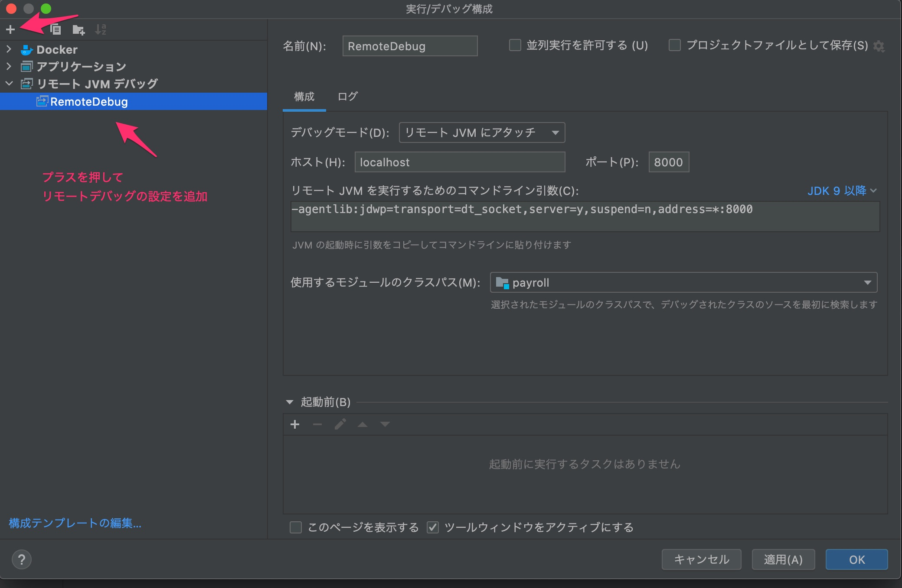

# demo-payroll
demo-payroll

# 本APIについて
こちらのデモを参考に API を作成しています。

https://spring.io/guides/tutorials/rest/

# Dockerについて

イメージを作成する

```bash
docker build --tag java-docker .
```

コンテナを起動する

```bash
docker run --rm -d -p 8080:8080 --name springboot-server java-docker
# 停止する場合
docker stop springboot-server
```

API を実行する

```bash
curl -v http://localhost:8080/employees | jq
curl -v http://localhost:8080/order | jq
```

ローカル開発する




```bash
# コンテナを起動する
docker-compose -f docker-compose.dev.yml up --build
# ブレークポイントを設定してから API にアクセスする
curl -v http://localhost:8080/employees | jq
```

テストを実行

```bash
docker run -it --rm --name springboot-test java-docker ./mvnw test
```

テストを実行 (ビルドステージ)

```bash
docker build -t java-docker --target test .
docker run -it --rm --name springboot-test java-docker
```